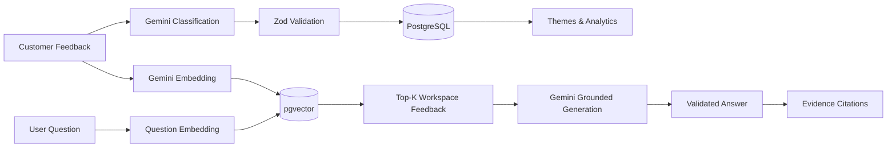
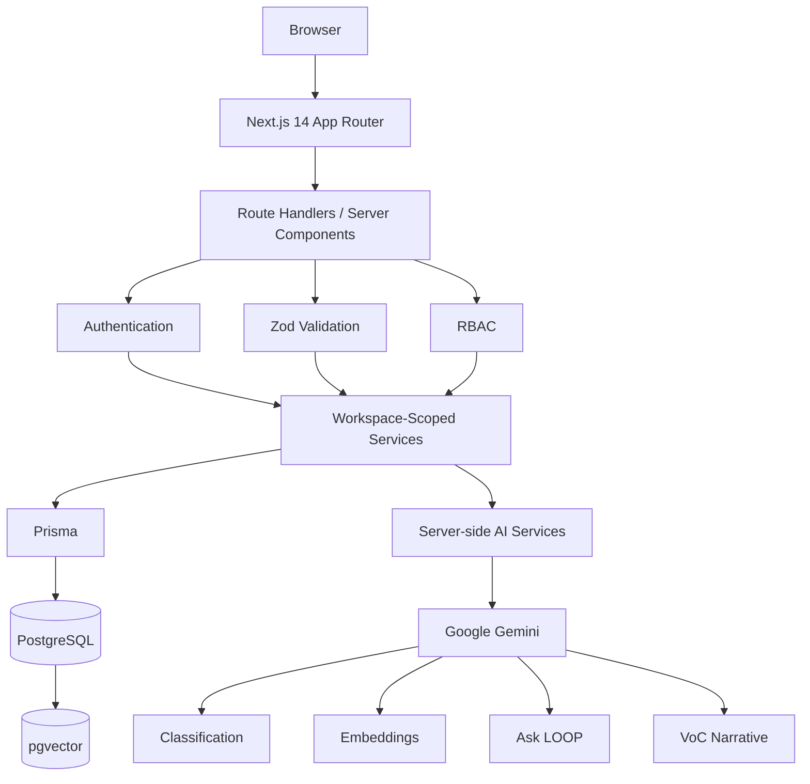

# LOOP — AI Customer Feedback Intelligence Platform

> **Turn scattered customer feedback into clear, evidence-backed product decisions.**

LOOP is a multi-tenant customer-feedback intelligence platform that centralizes feedback, classifies it with Google Gemini, surfaces themes and emerging trends, answers natural-language questions from retrieved evidence, and generates shareable Voice-of-Customer reports.

Instead of treating AI as a standalone chatbot, LOOP connects it directly to real product workflows: **ingestion → classification → analysis → retrieval → reporting → action**.


**AI Classification** · **Theme Intelligence** · **Semantic Search** · **Ask LOOP** · **VoC Reports** · **Multi-Tenant RBAC**

---

## Quick Links

| Resource         | Link                                    |
| ---------------- | --------------------------------------- |
| 🌐 Live Demo     | [Open LOOP](https://zidio-loop.vercel.app/) |
| 💻 Repository    | [GitHub Repository](https://github.com/goutamkushwah/Project-loop) |
| 🎥 Demo Video    | `[Demo Video URL]`                      |
| 📚 Documentation | [`docs/`](loop/docs/)                        |
| 🖼️ Screenshots  | [Product Preview](#product-preview)     |
| ⚙️ Installation  | [Local Development](#local-development) |

---

## Product Preview

### Authentication


### Dashboard


### Feedback Intelligence


### AI Intelligence


### Workspace Administration


---

## What is LOOP?

LOOP is a **multi-tenant, AI-powered customer-feedback intelligence platform** designed for teams that receive customer signals from multiple sources.

Feedback may arrive through:

* support tickets
* application reviews
* surveys
* customer-success or sales notes
* community feedback
* simulated integration channels

LOOP brings those signals into a single workspace and uses AI to **classify, cluster, retrieve, analyze, and summarize** them while keeping every insight traceable to the underlying customer evidence.

---

## The Problem

Customer feedback is valuable, but it is rarely organized.

Product teams often face the same problems:

* feedback is scattered across multiple channels
* manually reading every item does not scale
* tagging and prioritization become inconsistent
* emerging issues are difficult to identify early
* product decisions lack direct supporting evidence
* important customer signals disappear inside large volumes of text

A collection of feedback is not automatically useful intelligence.

---

## The Solution

LOOP closes the gap between **feedback, insight, and action**.

```text
Customer Feedback
       ↓
Centralized Inbox
       ↓
AI Classification
       ↓
Themes & Trends
       ↓
Grounded Ask LOOP
       ↓
Voice-of-Customer Report
       ↓
Evidence-backed Product Decisions
```

The goal is simple:

> **LOOP turns scattered customer feedback into a ranked, evidence-backed list of what to do next.**

---

# Key Features

## 🔐 Multi-Tenant Workspaces

Each company operates inside an isolated workspace.

Workspace-owned data—including feedback, themes, embeddings, reports, and members—is queried using the authenticated user's server-resolved `workspaceId`.

The browser never supplies the authoritative workspace identity.

---

## 👥 Role-Based Access Control

LOOP includes three roles:

* **ADMIN** — workspace administration plus all product capabilities
* **ANALYST** — feedback management and intelligence workflows
* **VIEWER** — read-only access to analytics and insights

Authorization is enforced on the server rather than relying on hidden UI controls.

---

## 📥 Feedback Ingestion

Feedback can enter LOOP through three supported workflows:

* manual single-entry feedback
* CSV bulk import
* simulated channel ingestion

CSV ingestion includes row validation and imported/failed summaries.

New feedback can then move through the Gemini classification and embedding pipelines.

---

## 📬 Feedback Inbox

The inbox provides a production-style feedback management workflow with:

* server-side pagination
* full-text search
* channel filtering
* sentiment filtering
* theme filtering
* workflow-status filtering
* date-range filtering
* compound filter combinations
* inline triage

Workflow:

```text
NEW → REVIEWED → ACTIONED
```

---

## 📊 Analytics Dashboard

The dashboard is backed by persisted PostgreSQL data rather than hard-coded chart values.

It includes:

* feedback volume over time
* sentiment breakdown
* top themes
* total feedback
* negative-feedback percentage
* new feedback this week
* classification coverage
* persisted classification-state metrics
* average stored sentiment score
* theme-assignment coverage

Dashboard analytics respect the active date, channel, and workflow filters.

---

## 🧠 AI Auto-Classification

Feedback is classified server-side using Google Gemini.

Each validated classification can contain:

* sentiment
* sentiment score from `-1` to `1`
* one or more themes
* theme confidence
* feature-area label
* grounded rationale

The pipeline uses:

```text
Feedback
   ↓
Gemini
   ↓
Structured JSON
   ↓
Zod Validation
   ↓
Persisted Classification
```

Classification results are stored in PostgreSQL instead of being regenerated every time a page loads.

Manual re-classification is available to authorized users.

---

## 📈 Theme Intelligence & Trends

LOOP converts individual feedback items into higher-level product themes.

Capabilities include:

* AI-assisted theme assignment
* existing-theme reuse
* theme counts
* theme search and sorting
* evidence drill-down
* assignment confidence
* daily theme volume
* current vs previous-period comparison
* emerging-theme detection

A theme is flagged as spiking when the current period meets all configured conditions:

```text
Current count >= 3
Absolute increase >= 2
Growth >= 50%
```

Themes with no previous-period baseline can also be treated as newly emerging once enough current evidence exists.

---

## 💬 Ask LOOP

**Ask LOOP** is the platform's retrieval-grounded Q&A experience.

Users can ask questions such as:

> What are users saying about onboarding?

The system does not simply send the question to an LLM.

Instead:

1. the question is converted into a Gemini embedding
2. PostgreSQL `pgvector` retrieves the most semantically relevant workspace feedback
3. only those retrieved items are supplied to Gemini as evidence
4. Gemini returns a structured answer
5. every cited feedback ID is validated against the retrieved evidence
6. the supporting feedback is displayed alongside the answer

```text
Question
   ↓
Gemini Embedding
   ↓
pgvector Semantic Search
   ↓
Top-K Feedback
   ↓
Gemini
   ↓
Grounded Answer + Evidence
```

If the retrieved evidence does not support the question, LOOP is designed to say that the available feedback is insufficient instead of inventing an answer.

---

## 📄 Voice-of-Customer Reports

LOOP can generate saved Voice-of-Customer reports for a selected date range.

Reports combine:

* feedback totals
* classification coverage
* sentiment distribution
* sentiment shifts
* top themes
* representative customer feedback
* AI-generated executive narrative
* recommended actions
* evidence references

Numerical report statistics are calculated in application code **before** Gemini receives the report context.

Gemini is used to write the narrative around those known facts rather than being asked to invent the statistics itself.

Reports can be:

* generated
* saved
* searched
* viewed later
* securely shared through read-only public capability links

---

# Why LOOP Is Different

### AI is part of the workflow

Classification, semantic search, trend intelligence, Q&A, and reporting are connected to the application's actual feedback lifecycle rather than existing as an isolated chatbot.

### AI outputs are persisted

Classification results and embeddings are stored once and reused instead of being recomputed on every page render.

### Ask LOOP is retrieval-grounded

Answers are generated from semantically retrieved workspace feedback, with citations validated against the retrieved evidence.

### Report numbers are deterministic

Counts, sentiment percentages, shifts, themes, and evidence are computed from PostgreSQL before Gemini generates the narrative.

### Insights remain traceable

Themes, Ask LOOP responses, reports, and recommendations can be connected back to supporting feedback.

### Tenant boundaries are enforced server-side

Workspace identity is resolved from the authenticated user rather than trusted from client input.

### AI credentials never belong in the browser

Gemini calls are performed server-side using environment variables.

---

# AI Pipeline



### Voice-of-Customer generation

```text
Selected Period
      ↓
PostgreSQL Statistics
      ↓
Top Themes + Sentiment Shifts + Evidence
      ↓
Gemini Narrative
      ↓
Zod + Evidence-ID Validation
      ↓
Saved Report
```

---

# System Architecture



### Request isolation model

```text
Authenticated User
        ↓
Resolve User
        ↓
Resolve Workspace
        ↓
Authorize Role
        ↓
Scope Query by workspaceId
        ↓
Return Data
```

> The browser never supplies an authoritative `workspaceId`. Workspace identity is determined from the authenticated server-side user.

---

# Multi-Tenancy & Security

LOOP was built around tenant isolation rather than adding it as an afterthought.

Key safeguards include:

* workspace-scoped database operations
* database-backed authenticated user resolution
* server-side role authorization
* HTTP `403` responses for forbidden operations
* Zod validation for mutable API input
* scrypt password hashing
* server-side Gemini API usage
* environment-based secret management
* same-origin protection for mutations
* tenant-aware resource lookups
* opaque report capability tokens
* SHA-256 storage of report-share token hashes
* non-disclosing behavior for missing or cross-workspace resource IDs
* `.env`, local databases, build artifacts, and `node_modules` excluded from source control

Public report URLs use capability tokens; raw share tokens are not stored in the database.

---

# Role Matrix

| Capability                    | Admin | Analyst | Viewer |
| ----------------------------- | :---: | :-----: | :----: |
| View dashboard                |   ✅   |    ✅    |    ✅   |
| View/search inbox             |   ✅   |    ✅    |    ✅   |
| View themes                   |   ✅   |    ✅    |    ✅   |
| View trends                   |   ✅   |    ✅    |    ✅   |
| Use Ask LOOP                  |   ✅   |    ✅    |    ✅   |
| Read saved reports            |   ✅   |    ✅    |    ✅   |
| Create/manage feedback        |   ✅   |    ✅    |    ❌   |
| Import CSV feedback           |   ✅   |    ✅    |    ❌   |
| Pull simulated feedback       |   ✅   |    ✅    |    ❌   |
| Update feedback workflow      |   ✅   |    ✅    |    ❌   |
| Classify/re-classify feedback |   ✅   |    ✅    |    ❌   |
| Run theme clustering          |   ✅   |    ✅    |    ❌   |
| Generate VoC reports          |   ✅   |    ✅    |    ❌   |
| Share/revoke report links     |   ✅   |    ✅    |    ❌   |
| Manage workspace members      |   ✅   |    ❌    |    ❌   |
| Change workspace roles        |   ✅   |    ❌    |    ❌   |

---

# Technology Stack

| Layer                | Technology                           |
| -------------------- | ------------------------------------ |
| Framework            | Next.js 14 App Router                |
| Language             | TypeScript                           |
| UI                   | React 18                             |
| Styling              | Tailwind CSS                         |
| Database             | PostgreSQL                           |
| ORM                  | Prisma 5                             |
| Authentication       | NextAuth.js 4 — Credentials provider |
| Authorization        | Server-side RBAC                     |
| Validation           | Zod                                  |
| AI SDK               | Google Gemini via `@google/genai`    |
| Generation           | Gemini server-side generation        |
| Embeddings           | `gemini-embedding-2`                 |
| Embedding dimensions | 768                                  |
| Vector search        | PostgreSQL `pgvector`                |
| Vector index         | HNSW with cosine distance            |
| Charts               | Recharts                             |
| Deployment           | Vercel                               |

---

# Data Model

| Entity          | Purpose                                                                            |
| --------------- | ---------------------------------------------------------------------------------- |
| `Workspace`     | Tenant boundary that owns members, feedback, themes, and reports                   |
| `User`          | Authenticated workspace member with `ADMIN`, `ANALYST`, or `VIEWER` role           |
| `Feedback`      | Customer feedback, source metadata, workflow state, sentiment, classification data |
| `Theme`         | Workspace-owned category representing recurring feedback topics                    |
| `FeedbackTheme` | Many-to-many feedback/theme assignment with confidence                             |
| `Embedding`     | Stored semantic vector for a feedback item                                         |
| `Report`        | Saved Voice-of-Customer report snapshot and sharing state                          |

Conceptually:

```text
Workspace
 ├── Users
 ├── Feedback
 │    ├── FeedbackTheme ── Theme
 │    └── Embedding
 └── Reports
```

Tenant-owned relationships are scoped to the same workspace.

---

# Routes / Application Areas

| Route                    | Purpose                                                      |
| ------------------------ | ------------------------------------------------------------ |
| `/dashboard`             | Feedback volume, sentiment, themes, and persisted AI metrics |
| `/inbox`                 | Ingestion, search, filters, classification, and triage       |
| `/themes`                | Theme catalog, counts, clustering, and evidence drill-down   |
| `/trends`                | Theme volume, period comparison, and spike detection         |
| `/ask`                   | Retrieval-grounded natural-language Q&A                      |
| `/reports`               | Generate and browse Voice-of-Customer reports                |
| `/reports/:id`           | View a saved report and manage sharing                       |
| `/settings/members`      | Admin-only member and role management                        |
| `/shared/reports/:token` | Public read-only shared report                               |
| `/api/health`            | Database-backed health check                                 |

---

# Demo

**Live application:** `[Live Demo URL]`

The seeded demo workspace is:

```text
Acme Cloud
```

### Disposable Demo Credentials

| Role    | Email               | Password           |
| ------- | ------------------- | ------------------ |
| Admin   | `admin@loop.demo`   | `LoopAdmin!2026`   |
| Analyst | `analyst@loop.demo` | `LoopAnalyst!2026` |
| Viewer  | `viewer@loop.demo`  | `LoopViewer!2026`  |

> These credentials are intentionally provided for the disposable seeded demo workspace. They are not production credentials and should not be reused for personal or real-world accounts.

---

# Local Development

## Prerequisites

Before starting, install or configure:

* Node.js 20+
* npm
* Git
* PostgreSQL with the `vector` extension
* Google Gemini API key

Hosted PostgreSQL providers such as Neon or Supabase can be used if `pgvector` is available.

---

## 1. Clone the repository

```bash
git clone <YOUR_REPOSITORY_URL>
cd loop
npm install
```

---

## 2. Configure the environment

Copy the example environment file:

```bash
cp .env.example .env
```

Windows PowerShell:

```powershell
Copy-Item .env.example .env
```

Configure:

```env
DATABASE_URL=
NEXTAUTH_URL=
NEXTAUTH_SECRET=
GEMINI_API_KEY=

SEED_ADMIN_PASSWORD=
SEED_ANALYST_PASSWORD=
SEED_VIEWER_PASSWORD=
```

Example local `NEXTAUTH_URL`:

```env
NEXTAUTH_URL="http://localhost:3000"
```

Generate a secure NextAuth secret with a local tool such as:

```bash
openssl rand -base64 32
```

Never commit `.env` files, database URLs, authentication secrets, or Gemini API keys.

---

## 3. Prepare the database

```bash
npm run db:validate
npm run prisma:generate
npm run db:migrate:deploy
```

The migrations configure the PostgreSQL features required by LOOP, including the `vector` extension and the vector index used for semantic retrieval.

---

## 4. Load the final demo dataset

```bash
npm run db:seed:final
```

This runs the full demo-data workflow:

```text
Base Seed
   ↓
Gemini Classification Backfill
   ↓
Gemini Embedding Backfill
   ↓
Final Seed Verification
```

---

## 5. Start LOOP

```bash
npm run dev
```

Open:

```text
http://localhost:3000
```

---

# Environment Variables

| Variable                | Purpose                                    |  Required  |
| ----------------------- | ------------------------------------------ | :--------: |
| `DATABASE_URL`          | PostgreSQL connection string               |     Yes    |
| `NEXTAUTH_URL`          | Application origin used by NextAuth        | Production |
| `NEXTAUTH_SECRET`       | Signs and protects authentication sessions |     Yes    |
| `GEMINI_API_KEY`        | Server-side Google Gemini access           |     Yes    |
| `SEED_ADMIN_PASSWORD`   | Override password for seeded Admin         |     No     |
| `SEED_ANALYST_PASSWORD` | Override password for seeded Analyst       |     No     |
| `SEED_VIEWER_PASSWORD`  | Override password for seeded Viewer        |     No     |

No Gemini key is exposed through a `NEXT_PUBLIC_*` environment variable.

---

# Database & Seed Data

LOOP includes a realistic demo dataset so the core application and AI workflows can be evaluated without manually creating large amounts of feedback.

The final seeded environment contains:

* the **Acme Cloud** demo workspace
* one Admin
* one Analyst
* one Viewer
* 120 varied feedback items
* multiple feedback channels
* Gemini classifications
* theme assignments
* semantic embeddings

### Raw seed

Creates the base demo records without running the complete AI preparation pipeline:

```bash
npm run db:seed
```

### Final demo seed

Seeds, classifies, embeds, and verifies the demo dataset:

```bash
npm run db:seed:final
```

### Verify an existing seed

```bash
npm run db:verify:seed
```

The final verifier checks that the expected demo users and feedback exist and that classification, embedding, and theme-assignment preparation is complete.

---

# Quality & Verification

LOOP includes repository, build, seed, and deployment verification commands.

```bash
npm run typecheck
npm run lint
npm run format:check
npm run build
npm run ai:verify
npm run db:verify:seed
npm run qa:repo
npm run final:qa
```

Production smoke test:

```bash
npm run smoke -- --base-url=https://your-production-url.example
```

Strict pre-submission audit:

```bash
npm run qa:submission
```

| Command                           | Purpose                                                                      |
| --------------------------------- | ---------------------------------------------------------------------------- |
| `npm run typecheck`               | Validate TypeScript                                                          |
| `npm run lint`                    | Run ESLint                                                                   |
| `npm run format:check`            | Verify Prettier formatting                                                   |
| `npm run build`                   | Generate Prisma Client and build Next.js                                     |
| `npm run ai:verify`               | Verify Gemini structured-classification connectivity                         |
| `npm run db:verify:seed`          | Verify final seeded demo-data completeness                                   |
| `npm run smoke -- --base-url=...` | Exercise the deployed application and RBAC paths                             |
| `npm run qa:repo`                 | Audit repository structure, provider migration, docs, and secret hygiene     |
| `npm run final:qa`                | Run typecheck, lint, formatting, build, seed verification, and repository QA |
| `npm run qa:submission`           | Strict final audit requiring screenshots and a clean Git working tree        |

The project currently uses a verification-oriented QA workflow; dedicated API unit/integration test coverage remains a future stretch improvement.

---

# Deployment

LOOP is designed for deployment on **Vercel** with a PostgreSQL database that supports `pgvector`.

**Production URL:** `[Production URL]`

## 1. Configure production environment variables

Configure the following in Vercel:

```text
DATABASE_URL
NEXTAUTH_URL
NEXTAUTH_SECRET
GEMINI_API_KEY
SEED_ADMIN_PASSWORD
SEED_ANALYST_PASSWORD
SEED_VIEWER_PASSWORD
```

`NEXTAUTH_URL` should match the final production origin.

---

## 2. Apply committed migrations

```bash
npm run db:migrate:deploy
```

---

## 3. Prepare the final demo database

```bash
npm run db:seed:final
```

> The seed workflow targets the dedicated seeded demo workspace. Review the seed configuration before running it against any database containing data you need to preserve.

---

## 4. Run final quality checks

```bash
npm run final:qa
```

---

## 5. Deploy

```bash
npx vercel --prod
```

---

## 6. Smoke-test the deployment

```bash
npm run smoke -- --base-url=https://your-production-url.example
```

The smoke workflow checks important production paths including:

* landing/login accessibility
* database health
* Admin authentication
* Analyst authentication
* Viewer authentication
* dashboard access
* feedback APIs
* analytics APIs
* themes
* trends
* reports
* Admin member access
* Analyst/Viewer member-management denial

A failed smoke test should be treated as a deployment issue before submission.

---

# Project Structure

```text
loop/
├── app/
│   ├── (auth)/                  # Authentication and invitations
│   ├── (app)/                   # Protected product pages
│   ├── api/                     # Next.js Route Handlers
│   └── shared/reports/          # Public shared reports
│
├── components/                  # Forms, charts, tables and UI
├── docs/                        # Demo, QA and screenshot documentation
├── lib/                         # Auth, Gemini, validation, prompts, utilities
│
├── prisma/
│   ├── migrations/              # PostgreSQL schema history
│   ├── schema.prisma
│   ├── seed-data.ts
│   └── seed.ts
│
├── public/
│   └── templates/               # CSV import template
│
├── scripts/                     # Backfills, QA, seed verification, smoke tests
├── services/                    # Workspace-scoped business logic
├── types/                       # Shared TypeScript contracts
├── README.md
└── package.json
```

---

# Screenshot Gallery

The full screenshots are shown in [Product Preview](#product-preview).

| View                     | File                                                                             |
| ------------------------ | -------------------------------------------------------------------------------- |
| Login                    | [`docs/screenshots/01-login.png`](docs/screenshots/01-login.png)                 |
| Dashboard                | [`docs/screenshots/02-dashboard.png`](docs/screenshots/02-dashboard.png)         |
| Inbox                    | [`docs/screenshots/03-inbox.png`](docs/screenshots/03-inbox.png)                 |
| Themes                   | [`docs/screenshots/04-themes.png`](docs/screenshots/04-themes.png)               |
| Trends                   | [`docs/screenshots/05-trends.png`](docs/screenshots/05-trends.png)               |
| Ask LOOP                 | [`docs/screenshots/06-ask-loop.png`](docs/screenshots/06-ask-loop.png)           |
| Voice-of-Customer Report | [`docs/screenshots/07-voc-report.png`](docs/screenshots/07-voc-report.png)       |
| Admin Members            | [`docs/screenshots/08-admin-members.png`](docs/screenshots/08-admin-members.png) |

---

# Project Scope

LOOP intentionally focuses on the customer-feedback intelligence workflow.

The following are outside the implemented internship scope:

* billing and payments
* native mobile applications
* real-time collaboration/WebSocket infrastructure
* email/SMS delivery infrastructure
* live third-party feedback integrations

Simulated channel ingestion is intentional and provides integration-style feedback data without requiring external vendor services.

---

# Roadmap / Stretch Ideas

These are possible extensions, not current functionality:

* **Saved views / segments** — reusable inbox filters such as negative onboarding feedback
* **Suggested actions** — turn recurring feedback themes into draft product tasks
* **Sentiment alerts** — notify the product team when negative sentiment rises significantly
* **API test coverage** — expand automated API-level testing with a dedicated test suite

---

# Team

LOOP was built by:

* **Goutam Kushwah**
* **Gaurav Athode**
* **Sneha Sekar**
* **Mohan Sahu**

**Zidio Development — Web Development Track**

---

# Internship Context

LOOP was developed as part of the **Zidio Development Web Development Track** internship.

The project was designed as a production-style implementation demonstrating practical experience with:

* full-stack web development
* SaaS architecture
* multi-tenancy
* authentication and RBAC
* PostgreSQL database design
* AI integration
* structured model outputs
* semantic search and RAG
* data visualization
* production security patterns
* deployment and operational QA

The implementation intentionally treats LOOP as a complete product workflow rather than a standalone AI demonstration.

---

# License / Note

No open-source license is currently declared for this repository.

> This project was developed as part of the Zidio Development internship program. Repository usage and demo credentials should follow the internship and submission requirements.
